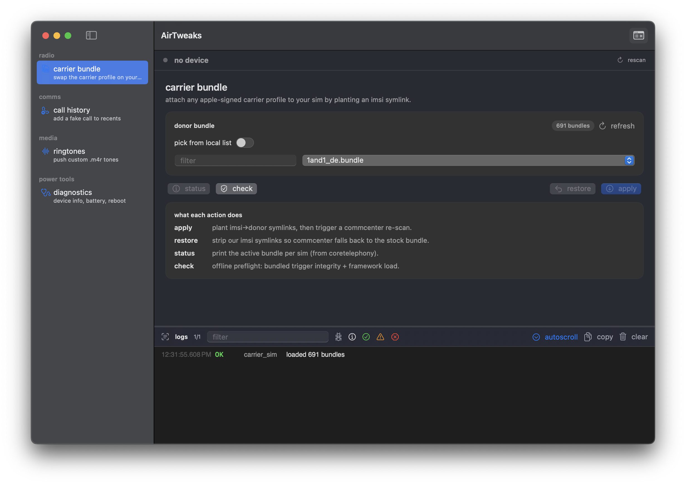

# AirTweaks

<p align="center">
  
</p>

<p align="center">
  <em>100% aislop
  native macOS cockpit for iPhone tweaks over usb — carrier bundle swap,
  fake call injection, ringtone push, one-shot diagnostics</em>
</p>

---

## features

| tweak            | what it does                                                                 |
| ---------------- | ---------------------------------------------------------------------------- |
| **carrier bundle** | attach any apple-signed carrier profile to your sim by planting an imsi symlink; the app ships 691 stock bundles from every iOS release |
| **call history** | insert a fabricated entry (missed / answered, incoming / outgoing, cellular / facetime) directly into `CallHistory.storedata` — appears in the phone app's recents as a real call |
| **ringtones**    | push custom `.m4r` / `.m4a` files into the ringtones list; delete existing tones; iOS picks them up on the next media scan |
| **diagnostics**  | one-shot device info, baseband, battery, storage, installed apps; reboot / shutdown over usbmux |

each tweak runs in its own airlift session — no jailbreak, no persistent daemon, no drivers, everything through a plain usb cable and apple's own `AirTrafficHost.framework`.

---

## installation (macOS)

1. grab the latest `AirTweaks.dmg` from **[releases](../../releases)**
2. open the disk image and drag `AirTweaks.app` into `/Applications/`
3. right-click → **open** (first launch only — gatekeeper prompt, since the build is self-signed)
4. plug in your iphone over usb and trust the mac if prompted

**requirements:** apple silicon mac (arm64), macOS 14 or newer. python / pymobiledevice3 are **not** required at runtime — everything ships inside the app bundle.

if gatekeeper still refuses to launch it (macOS 15+):

```bash
xattr -dr com.apple.quarantine /Applications/AirTweaks.app
```

---

## building from source

```bash
git clone https://github.com/shyalice/airtweaks.git
cd airtweaks
bash Scripts/build.sh
open build/AirTweaks.app
```

`build.sh` does three things:

1. spins up a private venv, installs `pyinstaller` + `pymobiledevice3`, freezes the whole backend into `build/backend-dist/airtweaks-backend/` (~116 MB, self-contained)
2. `swift build --configuration release` produces the swiftui shell
3. wraps everything into `build/AirTweaks.app` and ad-hoc codesigns it

for a distributable dmg on top of that:

```bash
BUILD_DMG=1 bash Scripts/build.sh
# or, from an existing .app:
bash Scripts/dmg.sh
```

lands at `build/AirTweaks.dmg` (~51 MB compressed, drag-to-Applications layout).

for iterative python-only work, skip the pyinstaller step:

```bash
SKIP_PYINSTALLER=1 bash Scripts/build.sh
```

**build requirements:** xcode command line tools, `python3.11` or newer with `venv` (any homebrew / system python).

---

## layout

```
Sources/AirTweaks/         swiftui app (feature registry, split view, log console)
  App/                     content view + sidebar + log console + device status bar
  Core/                    airlift bridge, device manager, log store, theme
  Features/*/              one folder per tweak
Python/backend.py          dispatcher entry (single binary via pyinstaller)
Python/features/_airlift.py   airtraffic read/write primitives (ctypes)
Python/features/*.py       one file per feature (carrier_sim, call_history, ...)
Scripts/build_backend.sh   pyinstaller onedir bundle
Scripts/build.sh           full .app assembly
Scripts/dmg.sh             distributable .dmg with drag-to-Applications layout
```

---

## donate

if this saved you a rooting session, tips are appreciated.

| chain     | address                                                                   |
| --------- | ------------------------------------------------------------------------- |
| **TRC20** | `TWj5QcEhkMa1YkdT2ju7fAKLdfWRvJK7Vp`                                      |
| **BTC**   | `bc1qkcpwpkpy8nd49kh3d0fd8z9884nndx93zxwyha`                              |
| **ETH**   | `0xDE64c372520B2cD09480faf746B1cBE5C141F45C`                              |
| **TON**   | `UQA_kTWg-195MWuUg51SOFFC2aK6h2nV1GLv9nvzsQkNd3kY`                        |

---

## credits

- **vlw** — [CarrierSIM](https://github.com/ios-bundles/CarrierSIM) — the original carrier bundle swap ceremony that AirTweaks' `carrier_sim` feature is ported from
- **0xjohnny** — [airlift](https://github.com/0xjohnnydev/airlift) — the streaming-zip + symlink-escape exploit powering every write path in this app

---

## see also (other ios 26 tweaks)

- **AirCard** — [Mak5er](https://github.com/Mak5er/AirCard) — change your apple pay card designs and passcode themes (airlift-based)
- **PocketPoster** — [Mak5er](https://github.com/Mak5er/Pocket-Poster) — live wallpapers via bad_query
